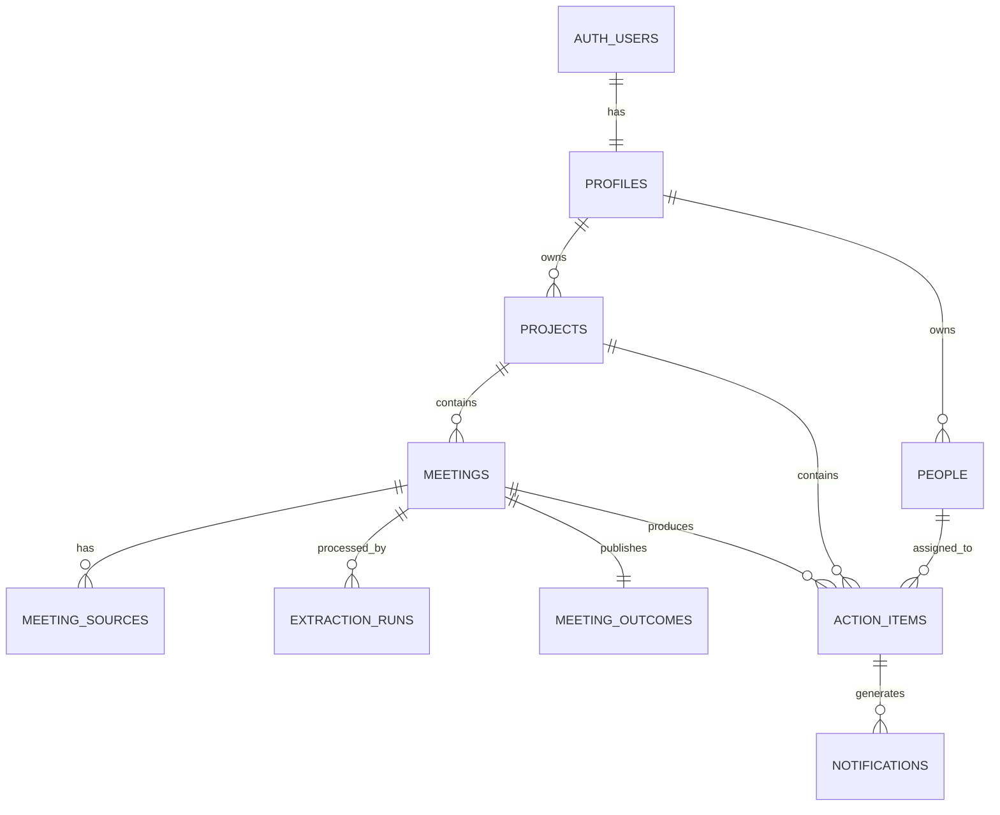

# Database Schema

## Core Entities



## Tables

- `profiles`: full name, current position, timestamps
- `projects`: owner, name, description, status
- `people`: reusable PIC data for P1
- `meetings`: project, title, date, participants, status, publication status
- `meeting_sources`: file or pasted text, storage path, raw text, source order
- `extraction_runs`: provider, model, status, raw and validated output, timing, errors
- `meeting_outcomes`: summary, decisions, blockers, unresolved questions, review method and status
- `action_items`: project, meeting, title, description, PIC, deadline, priority, status, source reference, official flag
- `notifications`: action item, reminder type, read state

## Core Constraints

- Every project belongs to one authenticated user.
- Every meeting belongs to one Active project at creation.
- Every meeting source belongs to one meeting.
- Dashboard, Search, and Reminders query official records only.
- A project cannot become Done while any official action remains unfinished.
- Original meeting sources cannot be modified by action-item edits.
- `due_time` may be null while `due_date` exists.
- Missing due date must remain null.
- Draft publication must be transactional.

## RLS Strategy

Each user-owned table restricts rows using the authenticated user ID.

```sql
using (user_id = auth.uid())
with check (user_id = auth.uid())
```

Child-table access should be validated through the parent meeting or project.

## Migration Rules

- One migration represents one coherent schema change.
- Never edit an already-applied migration.
- Create a new migration for corrections.
- Update this document when schema changes.
- Shared table changes require review from both developers.
